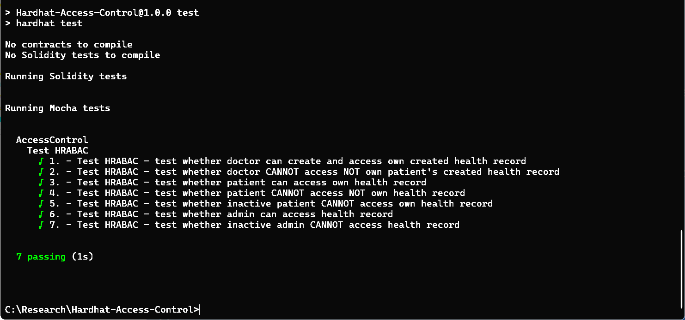

# Implementation and testing of Hybrid Role and Attribute Based Access Control (HRABAC) in blockchain smart contracts.

There are three roles: Admin, Doctor and Patient. 

- Admin should see all the Electronic Health Records (EHR) in the hospital;
- Doctor should create new EHR and see only these, that he/she has created;
- Pateint should see only his/her own EHR.

# Impementation in smart contracts

Solidity language implements blockchain with applied access control.

# Running tests 

Unit tests are written in `Hardhat` (`Ethers` and `Mocha`)

npm test

# Unit tests pass successfully.

